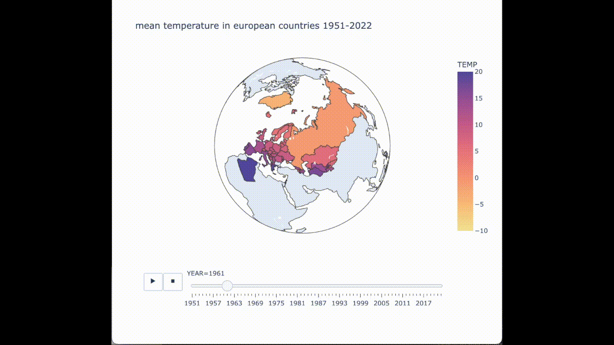
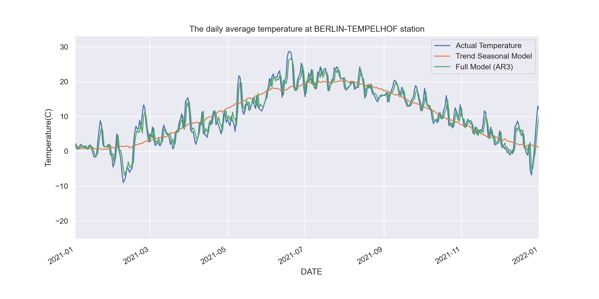

# Timeseries Analysis Temperature

- Prepared a temperature forecast using temperature data from [the website of the European Climate Assessment & Dataset project](https://www.ecad.eu/)
- Performed data cleaning and did a step-by-step time series analysis of the data, starting a base model to model trend and seasonality
- Built and evaluated  AR and ARIMA models.

Figure : Prediction of temperature for Berlin-Tempelhof station via differnet models for 2021
